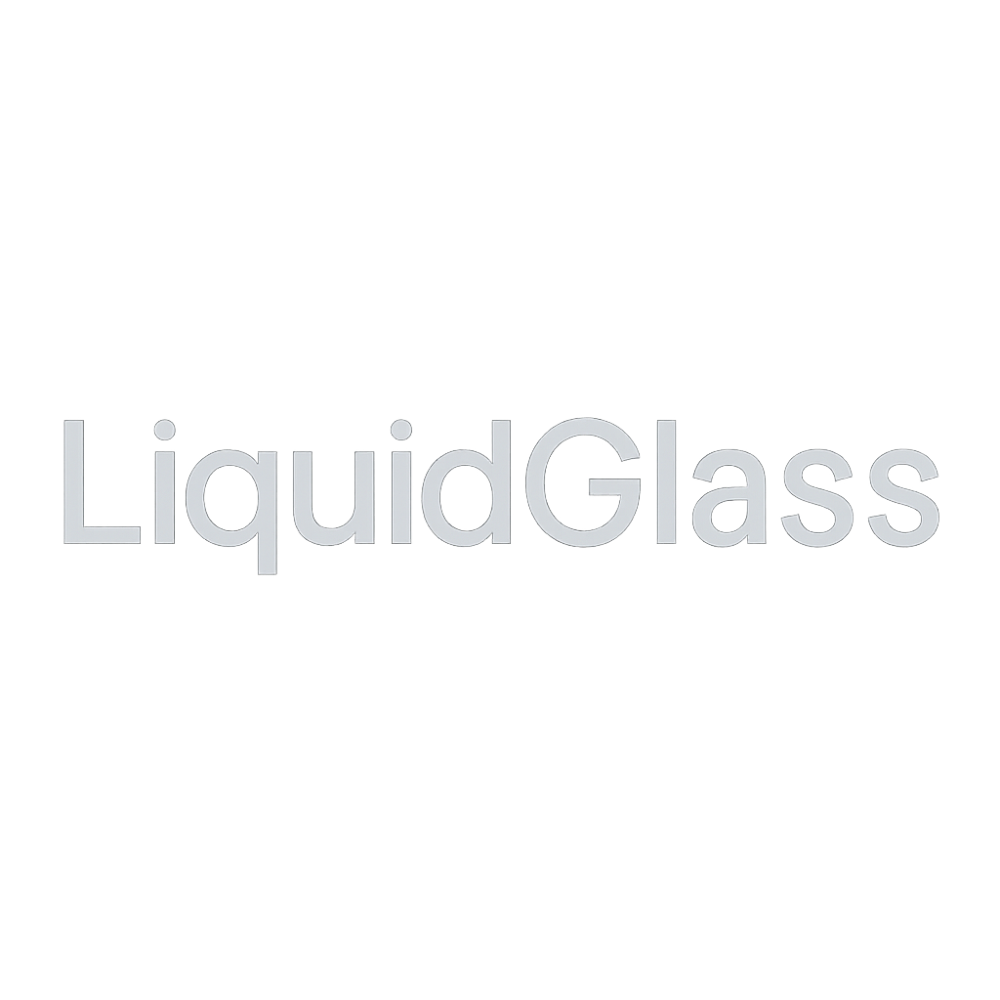

<p align="center">
  
</p>

> **Real‑time frosted glass and liquid‑like refraction for any SwiftUI view – no screenshots, no boilerplate.**

<p align="center">
  <a href="https://swiftpackageindex.com/YourOrg/LiquidGlassSwift"></a>
  
  
  
</p>

---

## ✨ Features

|                              |                                                                                                    |
| ---------------------------- | -------------------------------------------------------------------------------------------------- |
| 🔍 **Zero screenshots**      | Background is captured automatically – just drop `liquidGlassBackground` on any view.           |
| ⚡ **Real‑time**              | Optimised `MTLTexture` snapshots + lazy redraw; redraws only when the background actually changes. |
| 🛠 **Flexible update modes** | `.continuous`, `.once`, `.manual` via the `updateMode` modifier.                    |
| 🧩 **SwiftUI + UIKit**       | Works seamlessly in both frameworks with native APIs.                                            |
| 💤 **Battery‑friendly**      | MTKView stays paused until the provider notifies it – no wasted frames.                            |

## 🛠 Installation

Add *LiquidGlass* through Swift Package Manager:

```text
https://github.com/BarredEwe/LiquidGlass.git
```

Or via **Xcode » Package Dependencies…**
Select ***LiquidGlass*** and you’re done.

## 🚀 Quick start

### SwiftUI

```swift
Button("Glass Text") { }
    .liquidGlassBackground(cornerRadius: 60)
```

### UIKit

```swift
// Using extension (recommended)
button.addLiquidGlassBackground(cornerRadius: 25)

// Or using LiquidGlassUIView directly
let glassView = LiquidGlassUIView(cornerRadius: 30, blurScale: 0.8)
containerView.addSubview(glassView)
```

## 🖼 Examples

### SwiftUI Example

<table>
<tr>
<td width="50%">
  
```swift
ZStack {
    AnimatedColorsMeshGradientView()

    VStack(spacing: 20) {
        Text("Liquid Glass Button")
            .font(.title.bold())
            .foregroundColor(.white)

        Button("Click Me 🔥") {
            print("Tapped")
        }
        .foregroundStyle(.white)
        .font(.headline)
        .padding()
        .liquidGlassBackground(cornerRadius: 60)
    }
}
```
</td>

<td width="50%" align="center">
  
</td>
</tr>
</table>

### UIKit Example

```swift
class ViewController: UIViewController {
    override func viewDidLoad() {
        super.viewDidLoad()
        
        let button = UIButton(type: .system)
        button.setTitle("Glass Button", for: .normal)
        button.setTitleColor(.white, for: .normal)
        
        // Add liquid glass background
        button.addLiquidGlassBackground(
            cornerRadius: 25,
            updateMode: .continuous(interval: 0.1),
            blurScale: 0.7,
            tintColor: .white.withAlphaComponent(0.1)
        )
        
        view.addSubview(button)
        // ... setup constraints
    }
}
```

## ⚙️ Update modes

| Mode                     | What it does                              | Best for                                    |
| ------------------------ | ----------------------------------------- | ------------------------------------------- |
| `.continuous(interval:)` | Captures every *n* seconds.               | Animating backgrounds, parallax, fancy UIs. |
| `.once`                  | Captures exactly one frame.               | Static dialogs, settings sheets.            |
| `.manual`                | Capture only when you call `invalidate()` | Power‑saving, custom triggers.              |

### SwiftUI:

```swift
.liquidGlassBackground(updateMode: .once)
```

### UIKit:

```swift
// Using extension
button.addLiquidGlassBackground(updateMode: .manual)

// Manual invalidation
button.liquidGlassBackground?.invalidateBackground()

// Using LiquidGlassUIView directly
let glassView = LiquidGlassUIView(updateMode: .once)
glassView.invalidateBackground() // for manual updates
```

## 🎛 UIKit API Reference

### LiquidGlassUIView

```swift
// Initialization
let glassView = LiquidGlassUIView(
    cornerRadius: 20,
    updateMode: .continuous(),
    blurScale: 0.5,
    tintColor: .gray.withAlphaComponent(0.2)
)

// Properties (all animatable)
glassView.cornerRadius = 25
glassView.blurScale = 0.8
glassView.tintColor = .blue.withAlphaComponent(0.1)
glassView.updateMode = .manual

// Methods
glassView.invalidateBackground()
```

### UIView Extensions

```swift
// Add glass background (fills entire view)
view.addLiquidGlassBackground(cornerRadius: 20)

// Add glass background with custom frame
view.addLiquidGlassBackground(
    frame: CGRect(x: 0, y: 0, width: 200, height: 50),
    cornerRadius: 25
)

// Access glass backgrounds
let glassView = view.liquidGlassBackground
let allGlassViews = view.liquidGlassBackgrounds

// Remove glass backgrounds
view.removeLiquidGlassBackgrounds()
```

## 🎨 Shader & Customisation

* **Fragment shader** – tweak `Sources/LiquidGlass/Shaders/LiquidGlassShader.metal` to adjust blur radius, refraction strength, tint or chromatic aberration. Two editable functions:
  * `sampleBackground()` – distort UVs / add ripple
  * `postProcess()` – lift saturation, add tint, vignette, bloom.
* **Performance knobs** – lower snapshot interval, switch to `.once`, or optimise shader loops.

## 📈 Performance notes

* Snapshot covers only the area behind the glass – minimal memory.
* Layers above the glass are never hidden → no flicker.
* Lazy redraw means nearly zero GPU when nothing changes.
* UIKit and SwiftUI versions share the same optimized Metal backend.

## 🔄 Migration from SwiftUI-only

If you're upgrading from a SwiftUI-only version, no changes are needed for existing SwiftUI code. The new UIKit support is additive:

```swift
// Existing SwiftUI code continues to work unchanged
Button("Glass") { }
    .liquidGlassBackground()

// New UIKit support
button.addLiquidGlassBackground()
```

## 🙋‍♂️ FAQ

> **The glass doesn’t update when I scroll.**  
> Use `.continuous(interval: 0.016)` (≈60 fps) or trigger `.manual`'s `invalidate()` in `scrollViewDidScroll`.

> **Can I animate the glass properties?**  
> Yes! In UIKit, all properties (`cornerRadius`, `blurScale`, `tintColor`) are animatable with `UIView.animate()`.

> **How do I use this in a table view cell?**  
> Use `.once` or `.manual` update mode for better performance, and call `invalidateBackground()` when the cell is reused.

> **Can I mix SwiftUI and UIKit glass views?**  
> Absolutely! They use the same Metal backend and work seamlessly together.

## 🛡 License

MIT © 2025 • BarredEwe / Prefire

---

**Made with ❤️ & Metal**
